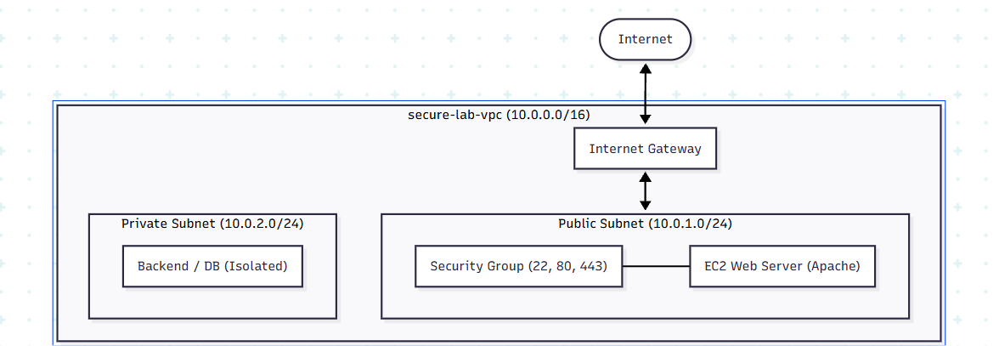
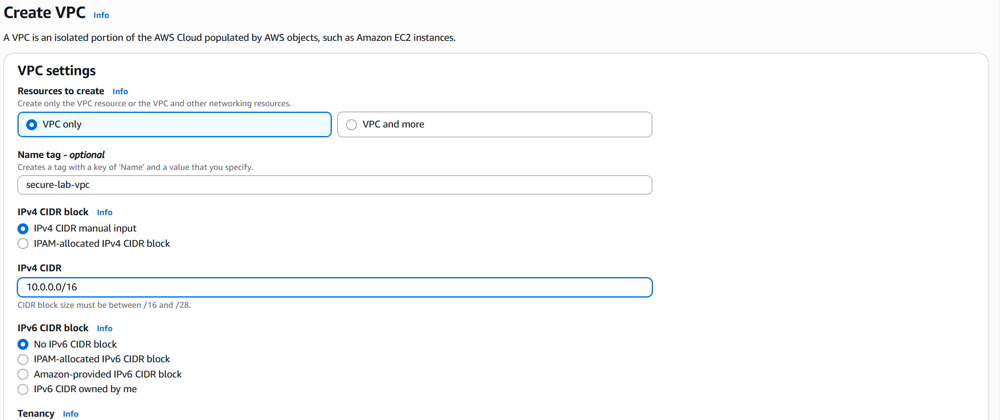
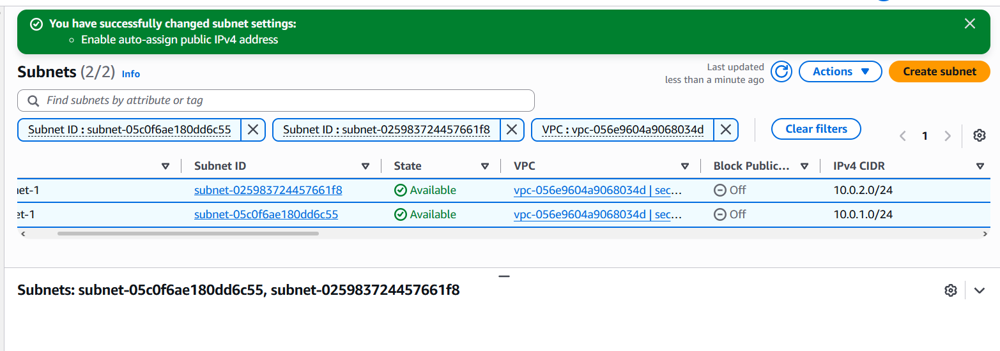
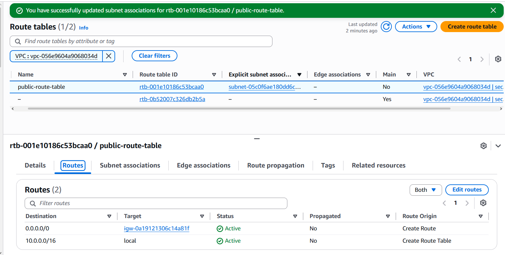
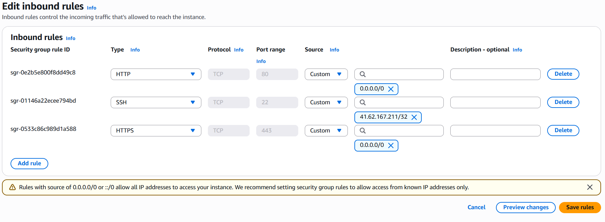
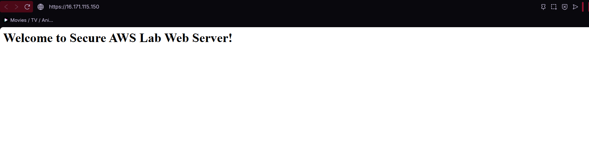
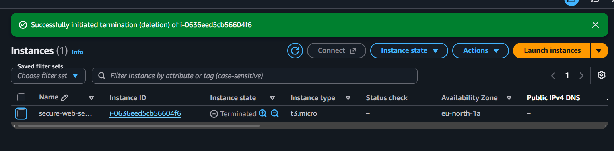
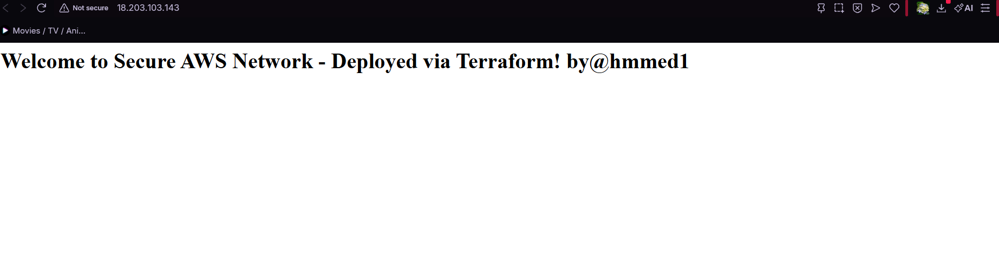

# Secure AWS VPC Web Server Lab

This project is a hands-on AWS networking and security lab. The goal is to build a small cloud environment from scratch and understand how the different AWS networking components work together.

This README is also a **step-by-step guide**. You can follow each section in order to recreate the lab yourself.

The lab covers:

* Creating an AWS VPC
* Dividing the VPC into public and private subnets
* Configuring Internet routing
* Securing an EC2 instance with a Security Group
* Deploying an Apache web server
* Enabling HTTPS with SSL/TLS
* Cleaning up the AWS environment after the lab

## Architecture

The final architecture looks like this:



The main idea is to separate resources based on their role. The web server is placed in the public subnet because it needs to be reachable from the Internet, while sensitive backend resources can be placed in the private subnet.

---

## Step 1: Creating the Base Virtual Private Cloud (VPC)

### Concept

A **Virtual Private Cloud (VPC)** is a private network inside AWS where we can deploy and organize our cloud resources.

For this lab, we start with a `/16` network:

```text
10.0.0.0/16
```

This provides 65,536 IPv4 addresses that can later be divided into smaller subnets.

The VPC will be the main network containing all the resources we create during the lab.

### Implementation Steps

1. Open the **VPC Dashboard** in the AWS Console.

2. Select **Create VPC**.

3. Choose the **VPC only** option. This allows us to create and configure each networking component manually.

4. Configure the following settings:

   * **Name Tag:** `secure-lab-vpc`
   * **IPv4 CIDR Block:** `10.0.0.0/16`
   * **Tenancy:** Default

5. After creating the VPC, open its settings and make sure the following options are enabled:

   * **DNS Hostnames**
   * **DNS Resolution**

These settings allow resources inside the VPC to use AWS DNS services and resolve domain names correctly.



---

## Step 2: Subnetting & Network Segmentation

### Concept

A large network is usually divided into smaller networks called **subnets**.

Our VPC uses:

```text
10.0.0.0/16
```

We divide it into two `/24` subnets:

```text
10.0.0.0/16
|
+-- Public Subnet
|   10.0.1.0/24
|
+-- Private Subnet
    10.0.2.0/24
```

Each `/24` subnet contains 256 IPv4 addresses.

The two subnets have different purposes:

* **Public Subnet:** Used for resources that need to be accessible from the Internet, such as a web server.
* **Private Subnet:** Used for resources that should not be directly accessible from the Internet, such as databases or backend services.

### Implementation Steps

1. Open **Subnets** in the VPC Dashboard.
2. Select **Create subnet**.
3. Make sure the subnets are associated with `secure-lab-vpc`.

### Create the Public Subnet

Create the following subnet:

* **Name:** `public-subnet-1`
* **CIDR:** `10.0.1.0/24`
* **Availability Zone:** `us-east-1a`

After creating it, modify the subnet settings and enable:

**Auto-assign public IPv4 address**

This allows EC2 instances launched in this subnet to automatically receive a public IPv4 address.

### Create the Private Subnet

Create another subnet with:

* **Name:** `private-subnet-1`
* **CIDR:** `10.0.2.0/24`
* **Availability Zone:** `us-east-1a`

The private subnet does not need public IPv4 addresses.



---

## Step 3: Internet Routing Setup

### Concept

Creating a VPC and a subnet does not automatically give the subnet access to the Internet.

To make our public subnet accessible from the Internet, we need:

1. An **Internet Gateway (IGW)**
2. A **Route Table**
3. A route that sends Internet traffic to the Internet Gateway

The default route inside the VPC is:

```text
10.0.0.0/16 -> local
```

This allows resources inside the VPC to communicate with each other.

We then add:

```text
0.0.0.0/0 -> Internet Gateway
```

This tells AWS to send traffic destined for the Internet through the Internet Gateway.

The private subnet is not associated with this public route table, so it does not have a direct route to the Internet.

### Implementation Steps

#### 1. Create the Internet Gateway

Create an Internet Gateway named:

```text
secure-lab-igw
```

Then attach it to:

```text
secure-lab-vpc
```

#### 2. Create the Public Route Table

Create a custom route table named:

```text
public-route-table
```

Make sure it belongs to:

```text
secure-lab-vpc
```

#### 3. Add the Internet Route

Add the following route:

```text
Destination: 0.0.0.0/0
Target:      secure-lab-igw
```

The route table should now contain:

| Destination   | Target           |
| ------------- | ---------------- |
| `10.0.0.0/16` | `local`          |
| `0.0.0.0/0`   | `secure-lab-igw` |

#### 4. Associate the Public Subnet

Associate:

```text
public-subnet-1
```

with:

```text
public-route-table
```

We do not associate `private-subnet-1` with this route table.



---

## Step 4: Network Security & Firewall Configuration

### Concept

AWS **Security Groups** act as virtual firewalls for resources such as EC2 instances.

They control which incoming and outgoing connections are allowed.

For this lab, we follow the principle of **least privilege**: only the ports that are required for the web server are opened.

The required ports are:

* **Port 22 — SSH:** Used for server administration.
* **Port 80 — HTTP:** Used for normal web traffic.
* **Port 443 — HTTPS:** Used for encrypted web traffic.

### Implementation Steps

1. Open **Security Groups** in the VPC Dashboard.

2. Select **Create security group**.

3. Configure:

   * **Name:** `web-server-sg`
   * **VPC:** `secure-lab-vpc`

4. Add the following inbound rules:

| Type  | Protocol | Port | Source                         | Purpose               |
| ----- | -------- | ---: | ------------------------------ | --------------------- |
| SSH   | TCP      |   22 | Your IP / EC2 Instance Connect | Server administration |
| HTTP  | TCP      |   80 | `0.0.0.0/0`                    | Web traffic           |
| HTTPS | TCP      |  443 | `0.0.0.0/0`                    | Secure web traffic    |

For SSH, it is better to restrict access to a trusted IP address when possible instead of allowing SSH from anywhere.

The default outbound rule can remain enabled for this lab.



---

## Step 5: Web Server Provisioning & SSL/TLS Encryption

### Concept

Now that the network and security configuration are ready, we can deploy our web server.

We use an **Amazon Linux 2023 EC2 instance** and place it inside the public subnet.

The server will run **Apache HTTP Server (`httpd`)** and will be accessible through HTTP and HTTPS.

We also create a self-signed SSL/TLS certificate because this lab does not use a registered domain name.

### Implementation Steps

1. Make sure the VPC has **DNS Resolution** and **DNS Hostnames** enabled.

2. Launch an EC2 instance with:

   * **Name:** `secure-web-server`
   * **VPC:** `secure-lab-vpc`
   * **Subnet:** `public-subnet-1`
   * **Security Group:** `web-server-sg`
   * **Operating System:** Amazon Linux 2023

3. Connect to the instance using **EC2 Instance Connect**.

4. Update the system:

```bash
sudo dnf update -y
```

5. Install Apache and SSL support:

```bash
sudo dnf install -y httpd mod_ssl
```

6. Start Apache:

```bash
sudo systemctl start httpd
```

7. Enable Apache so it starts automatically after a reboot:

```bash
sudo systemctl enable httpd
```

8. Create a simple landing page:

```bash
echo '<h1>Welcome to Secure AWS Lab Web Server!</h1>' | sudo tee /var/www/html/index.html
```

At this point, the server should be accessible over HTTP using its public IP address:

```text
http://YOUR_PUBLIC_IP
```



### Configure HTTPS

Because we do not have a registered domain name for this lab, we use a self-signed certificate for testing.

Generate a 2048-bit RSA certificate:

```bash
sudo openssl req -x509 -nodes -days 365 -newkey rsa:2048 \
  -keyout /etc/pki/tls/private/apache-selfsigned.key \
  -out /etc/pki/tls/certs/apache-selfsigned.crt
```

Then restart Apache:

```bash
sudo systemctl restart httpd
```

The server can now be tested over HTTPS:

```text
https://YOUR_PUBLIC_IP
```

A browser may display a certificate warning because the certificate is self-signed and is not trusted by a public Certificate Authority. This is expected in a learning environment.

In a production environment, we would normally use a certificate issued by a trusted Certificate Authority.

---

## Step 6: Resource Teardown & Environment Cleanup

### Concept

Cloud resources should not be left running after a lab is finished because some AWS services can generate charges.

For this reason, we remove the resources we created during the lab.

The general cleanup order is:

```text
EC2 Instance
      ↓
Internet Gateway
      ↓
Security Group
      ↓
VPC and networking resources
```

### Implementation Steps

#### 1. Terminate the EC2 Instance

Go to:

**EC2 Console → Instances**

Select:

`secure-web-server`

Then choose:

**Instance state → Terminate instance**

Wait until the instance reaches the `Terminated` state.

#### 2. Delete the Internet Gateway

Go to:

**VPC → Internet Gateways**

Select:

`secure-lab-igw`

First choose:

**Detach from VPC**

Then delete the Internet Gateway.

#### 3. Delete the Security Group

Go to:

**VPC → Security Groups**

Select:

`web-server-sg`

Then delete the Security Group.

#### 4. Delete the VPC

Go to:

**VPC → Your VPCs**

Select:

`secure-lab-vpc`

Then choose:

**Actions → Delete VPC**

Confirm the deletion.

AWS will remove the associated networking resources that are eligible for deletion, including the subnets and route tables created for this lab.



---

Step 7: Infrastructure as Code (IaC) & Automation
Concept
While building infrastructure manually through the AWS Console builds foundational knowledge, Infrastructure as Code (IaC) is standard practice in production.

Recommended Learning Resource
Want to learn how to build cloud infrastructure like this with Terraform? Check out this complete tutorial:

Terraform Course - Automate your AWS Cloud Infrastructure (freeCodeCamp)

Using Terraform, the entire network stack—VPC, subnets, route tables, security groups, and the web server—is defined in declarative configuration files. This makes deployments repeatable, version-controlled, and fast.

Implementation & Teardown
Deploy Infrastructure:

Bash
terraform init
terraform plan
terraform apply -auto-approve



Destroy Everything (Teardown):

Bash
terraform destroy -auto-approve
Running this command automatically removes all created AWS resources (EC2, VPC, Internet Gateway, Security Groups) in the correct dependency order, ensuring no leftover components generate unexpected costs.

This Project Will help you build a base in cloud concepts aswell as some networking consecepts
This lab can be expanded into a more realistic cloud architecture.


**Build it, test it, break it, fix it, and learn from it.**
